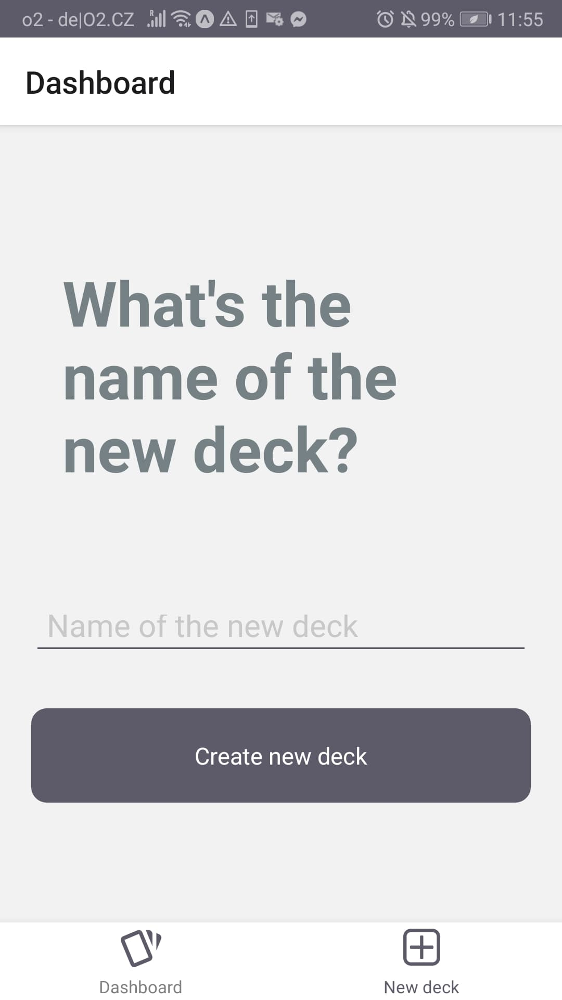

# Flashcard Mobile App

Flashcards  Android app in React Native. The app allows the user to create decks and add flashcards to them. The user can then take a quiz on the end of which they see their score. If no quiz was taken in a day, the user gets notification to his phone to complete one. 

### Installing

To install the project:
    
    npm install

### Running

To start the project:

    npm start

## Overview

First view of the app containing all of the user's decks.

The quiz view showing the questions and the answer and the right or wrong buttons.

The view where the user can add their own decks with cards.

